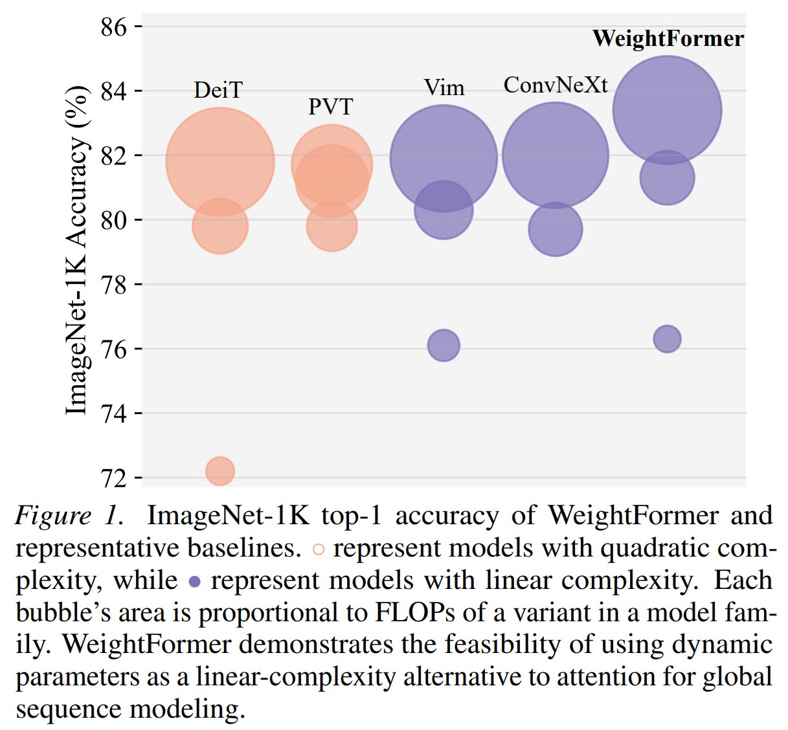
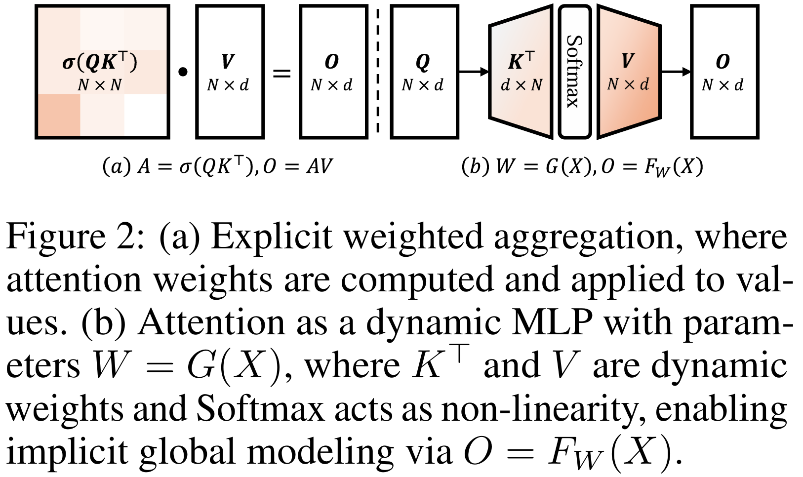
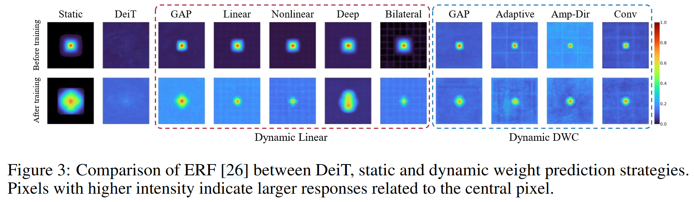
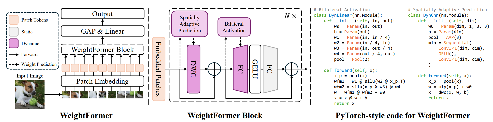

# WeightFormer

## Linear-Time Global Visual Modeling _without_ Explicit Attention

[arXiv](https://arxiv.org/abs/2605.01711) | [Hugging Face](https://huggingface.co/papers/2605.01711)

> [Ruize He\*](https://horizonll.github.io/),
> [Dongchen Han\*](https://scholar.google.com/citations?user=wv3U3tkAAAAJ),
> [Gao Huang ✉️](https://www.gaohuang.net)
>
> Tsinghua University
>
> Existing research largely attributes the global sequence modeling capability of Transformers to the explicit computation of attention weights, a process that inherently incurs quadratic computational complexity. In this work, we offer a novel perspective: we demonstrate that self-attention can be mathematically reframed as a Multi-Layer Perceptron (MLP) equipped with dynamically predicted parameters. Through this lens, we explain attention's global modeling power not as explicit token-wise aggregation, but as an _implicit_ process where dynamically generated parameters act as a compressed representation of the global context. Inspired by this insight, we investigate a fundamental question: _can we achieve Transformer-level sequence global modeling entirely through dynamic parameterization while maintaining linear complexity, effectively replacing explicit attention?_ To explore this, we design various dynamic parameter prediction strategies and integrate them into standard network layers. Extensive empirical studies on vision models demonstrate that dynamic parameterization can indeed serve as a highly effective, linear-complexity alternative to explicit attention, opening new pathways for efficient sequence modeling.

## Overview

<div align="center">




</div>

## Installation

### Option 1: uv (recommended)

```bash
uv sync
source .venv/bin/activate
```

### Option 2: Conda

```bash
conda create -n weightformer python=3.12 -y
conda activate weightformer
pip install -r requirements.txt
```

## Dataset Preparation

Prepare ImageNet-1K in the standard format:

```
imagenet
├── train
│   ├── class1
│   │   ├── img1.jpeg
│   │   └── ...
│   └── ...
└── val
    ├── class2
    │   ├── img2.jpeg
    │   └── ...
    └── ...
```

Then update the dataset path in:

```
cfg/*.yaml
```

## Image Classification

Training from scratch

```bash
torchrun --nproc_per_node=8 main.py --cfg cfg/wfm_t.yaml
```

Evaluation

```bash
torchrun --nproc_per_node=8 main.py --eval --cfg cfg/wfm_t.yaml --resume wfm-t.pth
```

Replace wfm_t.yaml with your desired config for the T, S, or B variants.

## Hugging Face Hub

Pretrained models are available on the [Hugging Face Hub](https://huggingface.co/RuizeHe):

```python
from model import WeightFormer_T, WeightFormer_S, WeightFormer_B

# Load a pretrained model from the Hub
model = WeightFormer_T.from_pretrained("RuizeHe/weightformer-t")
model = WeightFormer_S.from_pretrained("RuizeHe/weightformer-s")
model = WeightFormer_B.from_pretrained("RuizeHe/weightformer-b")
```

## Image Generation

To use WeightFormer in DiT-style image generation, replace [DiT](https://github.com/facebookresearch/DiT)'s `models.py` with `model/wfm_dit.py`.

Follow the setup instructions from [fast-DiT](https://github.com/chuanyangjin/fast-DiT) (recommended) or [DiT](https://github.com/facebookresearch/DiT) for training and evaluation.

[Weights and Logs](https://heruize-my.sharepoint.com/:f:/g/personal/heruize_heruize_onmicrosoft_com/IgDW3RiD_FsrRpxD-_ZgzmlMAaAus0IBb-tEfMIvy5Z9gOI?e=Os9jTc)

## Acknowledgements

This project is built upon [DeiT](https://github.com/facebookresearch/deit), [Swin Transformer](https://github.com/microsoft/Swin-Transformer), and [DiT](https://github.com/facebookresearch/DiT).

## Citation

```bibtex
@article{he2024weightformer,
  title={Linear-Time Global Visual Modeling without Explicit Attention},
  author={He, Ruize and Han, Dongchen and Huang, Gao},
  journal={arXiv preprint arXiv:2605.01711},
  year={2026}
}
```
